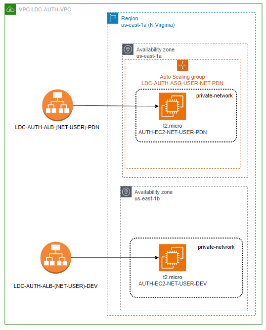

# CLOUDFORMATION-CHALLENGE

Deploying features by environments is a common feature when starting with an application. It is required to deploy a web application in two environments DEV and PDN. To do this, it is necessary to deploy the application in two EC2 instances together with two ALBs and in the case of PDN, it is required to work with an auto scaling group. 
 

## ARQUITECTURE
The architecture deployed in AWS is located within the VPC LDC-AUTH-VPC, located in the us-east-1 region (N. Virginia), and distributed across two availability zones: us-east-1a and us-east-1b. In the us-east-1a AZ, there is an Application Load Balancer (ALB) called LDC-AUTH-ALB-(NET-USER)-PDN, which distributes traffic to a t2.micro EC2 instance (AUTH-EC2-NET-USER-PDN) managed by an Auto Scaling Group (LDC-AUTH-ASG-USER-NET-PDN) within a private network. In the us-east-1b AZ, another ALB (LDC-AUTH-ALB-(NET-USER)-DEV) redirects traffic to an EC2 instance (AUTH-EC2-NET-USER-DEV), also in a private network, but without autoscaling. The architecture separates production (PDN) and development (DEV) environments, ensuring high availability for production through automatic scalability.

## CHALLENGE REQUIREMENTS
1. Create a VPC associated with the AUTHORIZATION LDC named LDC-AUTH-VPC
2. Create two t2.micro EC2 instances in a private network named LDC-AUTH_EC2_(USER-NETWORK)-PDN/DEV

3. Deploy the base project to the instances.

4. Create two ALBs connected to a single instance:

- LDC-AUTH-ALB-(USER-NETWORK)-DEV

- LDC-AUTH-ALB-(USER-NETWORK)-PDN

5. Create 1 ASG for the instance in the PDN environment
- LDC-AUTH-ASG-(USER-NETWORK)-PDN

6. 1 security group must be created per instance
- LDC-AUTH-SG-(USER-NETWORK)-PDN
- LDC-AUTH-SG-(USER-NETWORK)-DEV

7. The project must use nested stacks, at least in the security group; however, it can also use them in other features, such as the load balancer.
8. The network user name and maximum number of instances in the ASG must be a parameter within the template; Maps must be used for the availability zone and region.

9. Upon completion, the following output should be delivered:

- Network user name

- Load balancer name

- Security group name

- Instance name

10. Create a local feature/user-git branch

## DEPLOY-LOCAL

### Requirements to deploy 
1. You have to be installed the applications <a href="https://docs.docker.com/get-docker/"> Docker</a> and <a href="https://docs.docker.com/compose/install/"> Docker-compose </a>.
2. Any web browser..

## Get started
Use the command  docker-compose up . then both projects run at the same time; the backend is a java app, and the second one is an Angular app after a few minutes you could test all applications.

### Front-end 
1. First, go into the web browser and put this URL http://localhost:4200; you will see the main dashboard.

2. Select the option load file, choose the file, and upload. 

3. To download a file choose the file and the option download. 

3. To play a video choose the option with the camera icon in the leftside of the file, afterward the video player show (the app is tested with google chrome only) and choose the option play!  

## Documentation
Please check this post about backend app:
<a href="https://thinksprograms.blogspot.com/2023/03/file-server.html" target="_blank">File Server</a>

